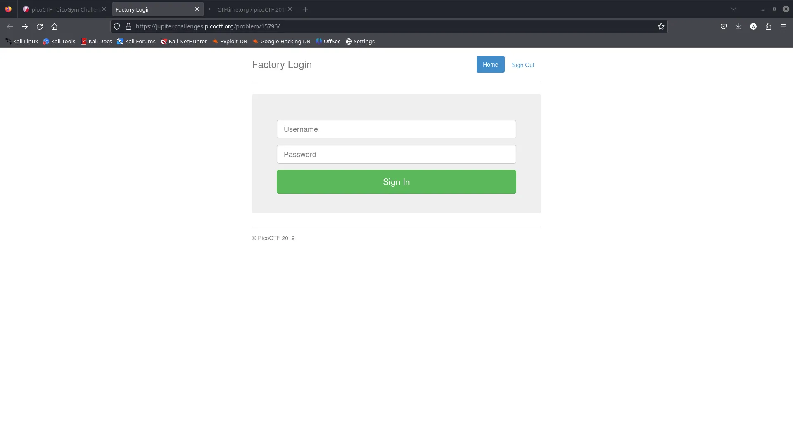
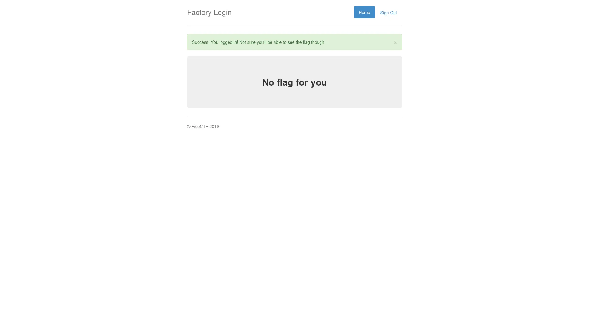
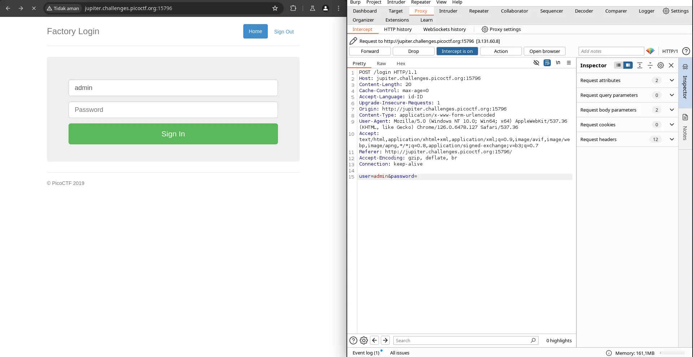
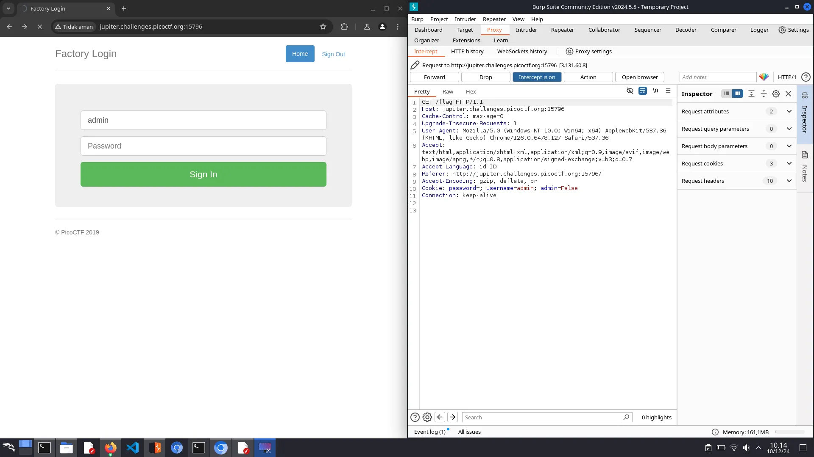
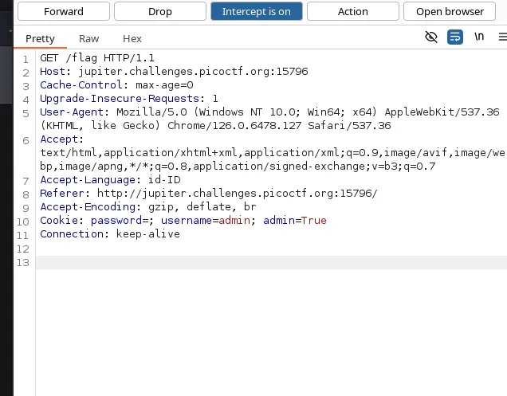
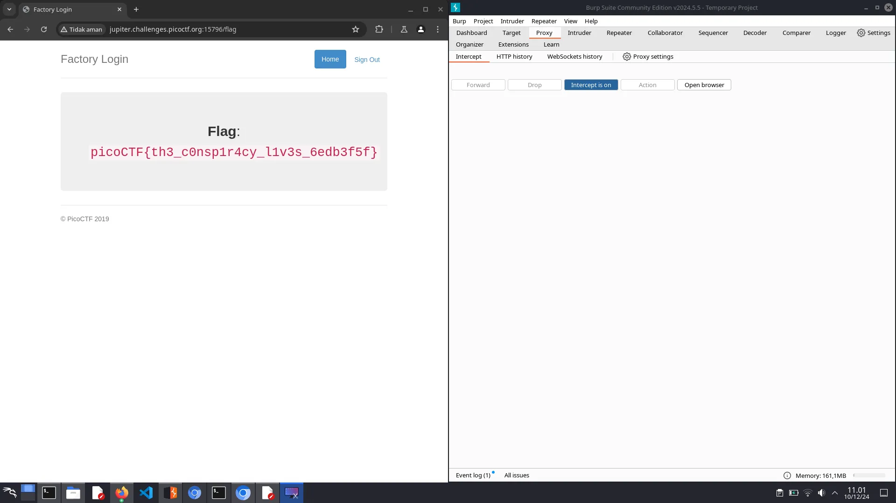

# Logon Writeup - picoCTF

Halo semuanya!!

Beginilah caraku menyelesaikan salah satu challenge picoCTF **Logon**.

## 1. Langkah Awal
Kita sudah tahu bahwa kita disuruh login pada websitenya:

## 2. Login Tanpa Password
Aku mencoba login tanpa memasukkan password, dan ternyata berhasil!

Namun, tidak ada flag yang muncul.

## 3. Analisis dengan Burp Suite
Karena merasa ada yang janggal, aku membuka Burp Suite untuk menganalisis request dan hasilnya seperti ini:

## 4. Temuan Parameter `admin=false`
Setelah mem-forward request, aku menemukan sesuatu yang mencurigakan: `admin=false`.

## 5. Mengubah `admin=false` menjadi `admin=true`
Aku mengganti nilai `false` menjadi `true`. Pastikan memperhatikan huruf besar/kecil (meskipun tidak selalu diperlukan, lebih baik berhati-hati).

## 6. Flag Ditemukan
Setelah mem-forward request lagi, akhirnya flag muncul!

